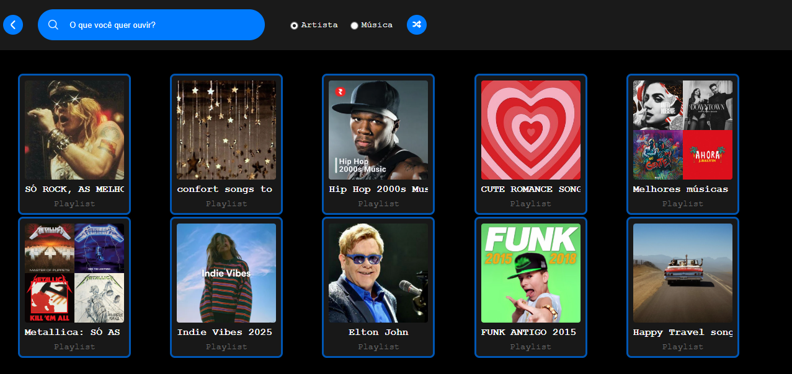

# Spotilike

Spotilike é um projeto front-end que reproduz, em forma de protótipo interativo, a experiência visual e de navegação de um player musical moderno. Idealizado como um exercício de design e implementação, o Spotilike evidencia habilidades em layout, usabilidade e integração com APIs musicais.

Sobre a ideia
------------
A ideia nasceu durante uma imersão de front-end: criar uma interface limpa e responsiva que permita explorar playlists, pesquisar por artistas e visualizar faixas de forma intuitiva. O foco foi construir uma experiência visual coerente e interativa, aplicando boas práticas de CSS e JavaScript moderno.

Funcionalidades principais
-------------------------
- Tela inicial com playlists em destaque e opção de embaralhar os resultados.
- Busca por artistas ou por faixas, com apresentação dos resultados em cartões visuais.
- Visualização das top tracks de um artista selecionado.
- Navegação fluida entre telas e layout responsivo que se adapta a diferentes tamanhos de tela.

Como o projeto demonstra habilidades
---------------------------------
- Organização de layout com CSS moderno e variáveis de tema (`src/styles/`).
- Uso de JavaScript modular (ES Modules) para separar responsabilidades entre carregamento, busca e integração com APIs.
- Práticas de UX na apresentação de resultados e interações com cartões.

Principais tecnologias
---------------------
- HTML5
- CSS3
- JavaScript (ES Modules)
- Font Awesome (ícones)

Estrutura resumida do projeto
----------------------------
```
c:\Dev\Spotilike\
├── busca.js
├── config.js
├── index.html
├── package.json
├── script.js
├── spotify-api.js
└── src/
	├── imagens/
	└── styles/
		├── reset.css
		├── skin.css
		└── vars.css
```

Como executar localmente
------------------------
1. Abra `index.html` diretamente no navegador para ver a interface.
2. Para testes via servidor (recomendado):

PowerShell (na raiz do projeto):
```powershell
npx http-server . -p 8080
# ou
# python -m http.server 8080
```

Abra `http://localhost:8080` no navegador.



